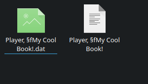
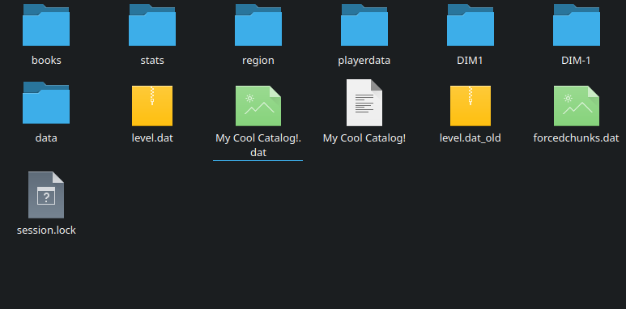

# An oversight within BiblioCraft which allows restricted server-side file manipulation.

***NEW: I have managed to get code execution by writing a specially encoded JAR to the `mods/` directory. This does not require any quirks such as abnormal JVM termination or a companion mod to work. More details and a new proof of concept soon.*** 


## Impact
Code execution is possible. Likely through multiple ways, but the one I found is outlined below.
This affects BiblioCraft 1.7.10 v1.11.7 (confirmed) and likely all BiblioCraft versions prior to v2.4.6 (unconfirmed, untested)


## Details
BiblioCraft has a Typesetting Table block which allows saving/loading book data from disk.

On a dedicated server, book data is stored within "*\<world-folder\>*/books/".
For vanilla books, the file name is set to "*\<player-name\>*, *\<book-title\>*".

For certain special books such as Recipe Books, two files are written.

One, named "*\<book-title\>*" stores metadata about the book. (public/private status, book type etc.)

The other, named "*\<book-title\>*.dat" stores the book's NBT tag, uncompressed.

*The data of a big book by "Player" named "My Cool Book!" in "world/books/":*




## The Exploit
Very roughly, the code that saves the book data looks like:
```java
boolean saveBook(ItemStack book, String type) {
    NBTTagCompound nbt = book.getTagCompound();
    String filename = "";
    String title = book.getDisplayName();
    boolean savedMeta = false;
    switch (type) {
        case "BigBook":
            String author = nbt.getString("author");
            filename = author + ", " + title;
            savedMeta = saveMetadata(...);
            break; 
        case "RecipeBook":
            filename = title;
            savedMeta = saveMetadata(...);
            break;
        case "Stockroom":
            filename = title;
            savedMeta = saveMetadata(...);
            break;
        default:
            return false;
    }

    if (savedMeta) {
        File output = new File(getBookDir(), filename + ".dat");
        writeNBTToFile(nbt, output);
    }
}
```

There is an issue with this code.
In the case of a recipe book or stockroom catalog, `filename` is set to `title`, which would the book's display name/title.

So what happens if our title contains "../"?

*== Renaming within the Stockroom Catalog interface will prepend a formatting code, you must rename in an anvil/other*


*The data of a Stockroom Catalog named "../My Cool Catalog!" in "world/":*



## The Proof of Concept

The second mod used in this proof-of-concept is [CoreTweaks](https://github.com/makamys/CoreTweaks). Specifically the transformer cache.

It is **NOT** an essential part of the overall exploit, it is only a method of code execution using file manipulation. You may still be vulnerable without it installed!


Within "*\<server-directory\>*/coretweaks/cache" is the file "transformerCache.dat".

This is a `HashMap<String, TransformerData>` serialized to disk by a Java serialization library called [Kryo](https://github.com/EsotericSoftware/kryo), loaded at startup by CoreTweaks and used to assist in speeding up class transformation.


## (Simplified version of) The Kryo File Format

The first element of a serialized map is a VarInt (variable-length integer) denoting how many key/value pairs exist within the map.

What follows are the key/value pairs.

Each serialized value within the map is prefixed by a VarInt type ID which tells the deserializer its type.

For strings, that ID is 3.  


## Deserializing strings
* If the string is null, the first byte will be (0 | 0x80).
* If the string is empty, the first byte will be (1 | 0x80).

If the string is ASCII-only, the first byte will not have the eighth bit set, and the deserializer will continue to read bytes until it finds a byte that does have the eighth bit set, and it will return a string made from the bytes read.

## Deserializing objects

All we need to know is that a 0 type ID always seems to mean null.

## The NBT file format

The [Named Binary Tag](https://wiki.vg/NBT) (NBT) is very simple.

Each datatype has a byte tag used to recognise it.

The top-level tag in a serialized NBT blob will always be a compound tag (ID 10). 

Compound tags (ID 10) are lists of named tags.

Each tag within the compound tag is prefixed by its type ID, then the length of its name as a big-endian 2-byte integer, then its name in [modified UTF-8](https://docs.oracle.com/javase/8/docs/api/java/io/DataInput.html#modified-utf-8).

Int tags (ID 3) are signed 32 bit integers encoded in big-endian format.

Byte array tags (ID 7) are byte arrays prefixed by their length as a signed 32-bit integer encoded in big-endian format.


## Mashing formats together

So, how do we construct a valid serialized Kryo HashMap when all we can write is NBT?

Let's say our NBT blob is something like
```
  TAG_Compound(''): 2 entries
  {
    TAG_Int(<int-tag-name>): 0
    TAG_Byte_Array(<byte-array-tag-name>): <bytes>
  }

```


Well, let's think back.

* The first element of the Kryo format is a VarInt.
* The first byte of the NBT blob is 10 (0x0A).

That's a valid VarInt denoting the value 10!

The next two bytes of the NBT blob are the length of its name. With an empty name, these two bytes would be zero.


The Kryo deserializer would see the two zero bytes, and parse a null key and a null value.


The next byte would be the tag type of the int, which is 3. The Kryo type ID for a String is too, 3.

The next two bytes would be the length of the string denoting the int tag's name. As long as those two bytes don't have their eighth bit set, they will be treated as part of the String being parsed by Kryo. Same with the name of the int tag.

What follows is the integer value. This can be anything as long as none of its bytes have their eighth bit set.

The next element in the compound tag is the byte array tag. This has an ID of 7, which does not have its eighth bit set so it is still part of the String being parsed by Kryo.

Next is its name, which follows the same rules as the int tag's name.

Next is the byte array length, which must not contain any bytes with the eighth bit set.

Finally is our byte array. Following that, the compound tag is ended by a 0 byte, but we don't need to worry about that.

For the first byte in our byte array, we will end the Kryo String by setting the eighth bit.

Now the second byte can just be a zero, for a null value.

From here on, we take advantage of Kryo to do the rest of serialization.

In pseudo-Java:
```java
Output output = ...;
Kryo kryo = new Kryo();
kryo2.writeClassAndObject(output, <hashmap-key>);
TransformerData data = ...;
kryo2.writeClassAndObject(output, data);
```

To ensure we get the right order of the tags in the output, since String hashing is deterministic we can try over and over with different keys for the int and byte array tags until they are serialized in the order we want. This allows us to generate a valid `transformerCache.dat` and write it to the correct location. (The server will need to be terminated abnormally (such as by `kill -9`), as CoreTweaks overwrites this file in a shutdown hook)

*== Filling up the server's memory with live objects which cannot be reclaimed by the garbage collector ***may*** be another way to cause an abnormal termination (could be done by spawning large amounts of entities, etc)*


When this file is loaded by CoreTweaks, any class transformations we specified will be applied, so we can execute any JVM code we like.
